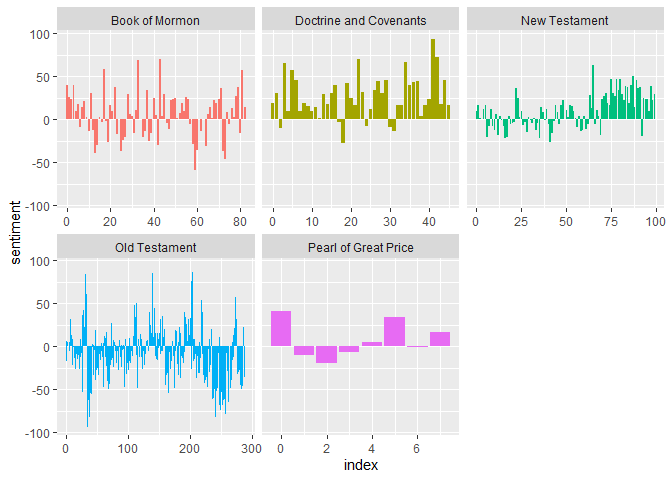

Scripture Analysis
================
Kit Applegate
2023-06-11

The code is a sentiment of the Church of Jesus Christ of Latter-Day
Saints scriptures. The results of the analysis can be used to understand
how the scriptures make people feel. For example, the plot that shows
the most common words with the sentiment “joy” shows that the word “joy”
is used frequently in the scriptures. This suggests the scriptures often
make people feel happy. The plot that shows the sentiment of each
chapter in the scriptures shows that most chapters have a positive
sentiment. This suggests that the scriptures are generally uplifting and
inspiring. I learned and used the code made by Julia Silge in her book
[Text Mining with R: A Tidy
Approach](https://www.tidytextmining.com/index.html)

1.  The first three lines of code load three libraries: tidyverse,
    scriptuRs, and tidytext. These libraries provide functions for data
    wrangling, text analysis, and sentiment analysis, respectively.

2.  The next line of code creates a data frame called lds_scriptures.
    This data frame contains the text of all of the scriptures in the
    Church of Jesus Christ of Latter-Day Saints canon.

3.  The next few lines of code create a plot that shows the number of
    verses in each book of the Church of Jesus Christ of Latter-Day
    Saints scriptures.

``` r
lds_scriptures %>%
  group_by(volume_title, book_title) %>%
  summarise(total_verses = n()) %>%
  arrange(desc(total_verses))
```

    ## # A tibble: 87 × 3
    ## # Groups:   volume_title [5]
    ##    volume_title           book_title             total_verses
    ##    <chr>                  <chr>                         <int>
    ##  1 Doctrine and Covenants Doctrine and Covenants         3654
    ##  2 Old Testament          Psalms                         2461
    ##  3 Book of Mormon         Alma                           1975
    ##  4 Old Testament          Genesis                        1533
    ##  5 Old Testament          Jeremiah                       1364
    ##  6 Old Testament          Isaiah                         1292
    ##  7 Old Testament          Numbers                        1288
    ##  8 Old Testament          Ezekiel                        1273
    ##  9 Old Testament          Exodus                         1213
    ## 10 New Testament          Luke                           1151
    ## # ℹ 77 more rows

4.  The next line of code creates a data frame called tidy_scriptures.
    This data frame is a smaller version of lds_scriptures that has been
    processed by the tidytext library. This processing includes breaking
    the text into individual words and assigning each word a sentiment.

5.  The next line of code creates a plot that shows the most common
    words with the sentiment “joy” in the the Church of Jesus Christ of
    Latter-Day Saints scriptures.

6.  The last line of code creates a plot that shows the sentiment of
    each chapter in the Church of Jesus Christ of Latter-Day Saints
    scriptures. The sentiment is calculated by counting the number of
    positive and negative words in each chapter and then subtracting the
    number of negative words from the number of positive words.

``` r
tidy_scriptures <- lds_scriptures %>%
  group_by(volume_title) %>%
  mutate(
    linenumber = row_number(),
    chapter = cumsum(str_detect(text, 
                                regex("^chapter [\\divxlc]", 
                                      ignore_case = TRUE)))) %>%
  ungroup() %>%
  unnest_tokens(word, text)

nrc_joy <- get_sentiments("nrc") %>% 
  filter(sentiment == "joy")

tidy_scriptures %>%
  inner_join(nrc_joy) %>%
  count(word, sort = TRUE)
```

    ## # A tibble: 328 × 2
    ##    word        n
    ##    <chr>   <int>
    ##  1 god      6878
    ##  2 good     1070
    ##  3 church    714
    ##  4 glory     675
    ##  5 art       660
    ##  6 faith     625
    ##  7 peace     585
    ##  8 found     530
    ##  9 blessed   529
    ## 10 save      490
    ## # ℹ 318 more rows

6.  The last line of code creates a plot that shows the sentiment of
    each chapter in the Church of Jesus Christ of Latter-Day Saints
    scriptures. The sentiment is calculated by counting the number of
    positive and negative words in each chapter and then subtracting the
    number of negative words from the number of positive words.

I found this to be a fascinating way to visualize the themes of the
scriptures. The Book of Mormon and the New Testament both show a cycle
of pride, turmoil, and hope, while the Doctrine and Covenants is mostly
positive. I hope you enjoyed this as much as I did!

``` r
scriptures_sentiment <- tidy_scriptures %>%
  inner_join(get_sentiments("bing")) %>%
  count(volume_title, index = linenumber %/% 80, sentiment) %>%
  pivot_wider(names_from = sentiment, values_from = n, values_fill = 0) %>% 
  mutate(sentiment = positive - negative)

ggplot(scriptures_sentiment, aes(index, sentiment, fill = volume_title)) +
  geom_col(show.legend = FALSE) +
  facet_wrap(~volume_title, scales = "free_x")
```

<!-- -->
